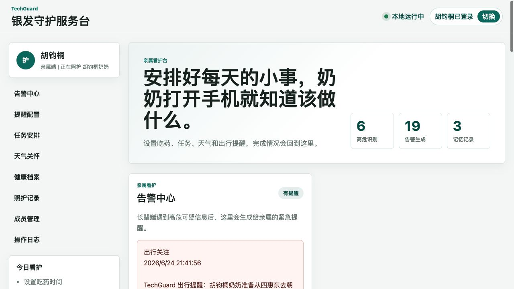
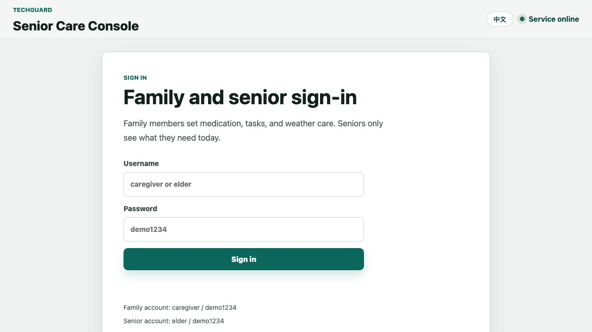

# TechGuard 银发守护服务台

## 中文版

TechGuard 是一个面向独居长辈与家庭看护人员的 AI 多 Agent 看护应用。它把吃药提醒、日常任务、防骗识别、天气关怀、出行规划、血压记录、体检报告分析和亲属通知组织在同一个服务台里，让长辈端尽量简单，让家属端可以持续配置、查看和跟进。



### 核心能力

- 双角色入口：长辈和家属登录后看到不同界面，功能边界清晰。
- 提醒 Agent：家属配置吃药、任务和出行安排，长辈端只需查看与确认。
- 反诈 Agent：长辈可手动粘贴可疑短信，系统识别链接、验证码、冒充机构和资金风险。
- 天气 Agent：按城市和区县生成适合长辈阅读的出门关怀。
- 出行 Agent：根据长辈一句话需求生成少换乘、少走路、易理解的出行建议。
- 健康 Agent：记录血压高压、低压、心率和备注，绘制趋势曲线；支持上传体检报告照片并生成健康管理建议。
- 通知 Agent：高危短信、异常健康记录、出行关注、任务到点等事件会进入家属告警中心，并可接入飞书机器人。
- 本地数据层：使用 SQLite 保存用户、提醒、任务、健康档案、告警和通知配置。

## English Version

TechGuard Senior Care Console is a multi-agent care application for older adults living independently and the family members who support them. It provides two separated experiences: seniors get a simple daily workspace for reminders, fraud checks, health records, and travel help, while caregivers can configure medication schedules, tasks, weather care, travel plans, and Feishu group notifications.

The highlight is its practical multi-agent workflow. A medication agent manages medicine reminders, a task agent tracks family assignments, a fraud-protection agent checks suspicious SMS messages, a health agent reviews blood pressure and checkup reports, a travel agent gives senior-friendly route advice, and a notification agent sends important events to the family care group. Together, these agents turn scattered care needs into clear, timely, and trackable actions.

TechGuard aims to make technology warmer and easier for seniors. It helps reduce digital anxiety, improves family care coordination, and gives older adults more confidence when facing daily health, travel, and online safety situations.

Full English documentation: [README_EN.md](README_EN.md)

English app URL:

```text
/?lang=en
```



## 演示账号

项目启动后会自动创建一组通用演示账号：

| 角色 | 登录名 | 密码 |
| --- | --- | --- |
| 家属端 | `caregiver` | `demo1234` |
| 长辈端 | `elder` | `demo1234` |

这些账号仅用于本地演示。公开部署前请替换为正式认证方案，并修改默认密码。

## 本地运行

```bash
PORT=5174 node server.mjs
```

打开浏览器访问：

```text
http://127.0.0.1:5174
```

英文界面：

```text
http://127.0.0.1:5174/?lang=en
```

局域网手机访问时，把 `127.0.0.1` 替换为电脑在同一 Wi-Fi 下的局域网地址。

## 可选配置

飞书机器人通知：

```bash
FEISHU_WEBHOOK_URL="https://open.feishu.cn/open-apis/bot/v2/hook/xxxx" PORT=5174 node server.mjs
```

线上定时提醒：

- `vercel.json` 已配置 `/api/cron/reminders` 每 5 分钟扫描一次到点任务和未确认吃药记录。
- 如果设置了 `CRON_SECRET`，Vercel Cron 会带上 `Authorization: Bearer $CRON_SECRET`，接口会用它校验来源。
- 5 分钟级 Cron 需要 Vercel Pro 计划；Hobby 计划只能使用每天一次的 Cron，若需准时提醒可改用外部定时服务调用同一路径。

OpenAI 出行和体检报告分析：

```bash
OPENAI_API_KEY="你的 OpenAI API Key" PORT=5174 node server.mjs
```

## 开发检查

```bash
node --check src/app.js
node --check server.mjs
node tests/core-smoke-test.js
```

## 目录结构

| 文件 | 说明 |
| --- | --- |
| `index.html` | 应用主页面 |
| `src/styles.css` | 响应式界面样式 |
| `src/app.js` | 前端交互、角色界面和模块渲染 |
| `server.mjs` | Node 服务、SQLite API、飞书通知和 AI 调用 |
| `sw.js` | 手机通知演示用 Service Worker |
| `tests/core-smoke-test.js` | 核心功能冒烟测试 |

## 数据与隐私

- 本地 SQLite 数据库默认创建在 `data/techguard.db`，该文件已在 `.gitignore` 中排除。
- 飞书 Webhook 和 OpenAI Key 请通过环境变量配置，不要写入代码仓库。
- 体检报告照片和健康数据属于敏感信息，生产环境建议迁移到受控对象存储，并增加访问权限、加密和审计。
